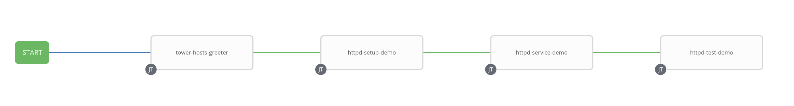

# Ansible Tower Demo

Welcome to this small Ansible Tower demo.
This repository instantiates the git repo for a demo project to be created in Tower.

## Bill of Materials

1xVM - Ansible Automation Platform  
1[N]xVM - RHEL Server(s) with devops user configured on it, sudo access with no password.

## Install Tower
Download Tower package on your machine:

    wget https://releases.ansible.com/ansible-tower/setup/ansible-tower-setup-latest.tar.gz
    tar -xvf ansible-tower-setup-latest.tar.gz
    cd cd ansible-tower-setup-<tower_version>

For a single node install, edit the inventory file to match the following:

    [tower]
    localhost ansible_connection=local

    [database]

    [all:vars]
    admin_password='ADMIN_PASSWORD_HERE'

    pg_host=''
    pg_port=''

    pg_database='DATABASE_NAME_HERE'
    pg_username='DATABASE_USERNAME_HERE'
    pg_password='DATABASE_PASSWORD_HERE'

Run the installer:

    ./setup.sh
  
Test your setup by visiting:  
    https://<TOWER_SERVER_NAME>/

And proceed importing your subscription!

## Generate an SSH key on managed host(s)

We will need to provide credentials to access our servers.

We can either provide the password for *devops* user or generate an SSH key:
    ssh-keygen

## Create Credentials
In Ansible Tower GUI, go into **Credentials** section and add a *Machine* Credential type for configuring access to our servers

Provide:

    NAME: devops-rhel8
    - Username and password
    OR
    - SSH Private Key

## Create a project

In Ansible Tower GUI, go into **Project** section, add a new project and fill out the fields:

    Name: ansible-tower-demo
    SCM Type: git
    SCM URL: https://github.com/kubealex/tower-playground.git
    UPDATE REVISION ON LAUNCH: Flagged

## Create an inventory

In Ansible Tower GUI, go into **Inventories** section, select the **+** and start creating a new inventory:

    Name: webservers

### Create host(s)

While in the newly created inventory, open the *Hosts* tab and create an entry for each host

    HOST NAME: IP/Hostname of the server

### Create a group

While in the newly created inventory, open the *Groups* tab and create a group

    NAME: webservers

Add the previously created host(s) to the group.

## Create job templates

In Ansible Tower GUI, go into **Templates** section, select the **+** and then *Job Template* and fill out the fields for each job:

### tower-hosts-greeter

A simple playbook to send a greet from the host it is running on.

    NAME: tower-hosts-greeter
    JOB TYPE: Run
    INVENTORY: webservers
    PROJECT: ansible-tower-demo
    PLAYBOOK: host-greeter/greeter.yml
    CREDENTIALS: devops-rhel8

### httpd-setup-demo

A simple playbook to install httpd package on our managed server(s)

    NAME: httpd-setup-demo
    JOB TYPE: Run
    INVENTORY: webservers
    PROJECT: ansible-tower-demo
    PLAYBOOK: apache-setup/apache-setup.yml
    CREDENTIALS: devops-rhel8

### httpd-service-demo

A simple playbook to enable httpd service on our managed server(s)

    NAME: httpd-service-demo
    JOB TYPE: Run
    INVENTORY: webservers
    PROJECT: ansible-tower-demo
    PLAYBOOK: apache-setup/apache-enable.yml
    CREDENTIALS: devops-rhel8

### httpd-test-demo

A simple playbook to test httpd setup on our managed server(s)

    NAME: httpd-test-demo
    JOB TYPE: Run
    INVENTORY: webservers
    PROJECT: ansible-tower-demo
    PLAYBOOK: apache-setup/apache-test.yml
    CREDENTIALS: devops-rhel8

## Create a workflow

In Ansible Tower GUI, go into **Templates** section, select the **+** and then *Workflow Template* and fill out the fields:

    NAME: ansible-tower-workflow-demo
    INVENTORY: webservers

Select the **WORKFLOW VISUALIZER** tab and concatenate the jobs you created.

